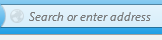

# เอกสารข้อกำหนดสำหรับ Firefox แสดงหน้าเว็บ มทส.

เอกสารนี้เป็นเอกสารข้อกำหนดสำหรับ Firefox ให้สามารถแสดงหน้าเว็บ
มทส. ได้ถูกต้อง

## เว็บเบราเซอร์ Firefox ต้องแสดงหน้าเว็บ มทส. ได้ถูกต้อง

กำหนดให้

    ความเหมือน 0.9

เมื่อ

    เปิด "c:/Program Files/Mozilla Firefox/firefox.exe"

และพิมพ์ url ที่ช่อง 

    คลิก "address bar"
    พิมพ์ "www.sut.ac.th\n"

แล้วควรจะเจอ 

    เจอ "โลโก้ มทส"

ทำเสร็จแล้ว

    ปิด