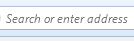
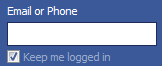
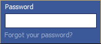
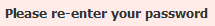

ฟีเจอร์ทดสอบการ Login เข้า Facebook ไม่ได้
--------------------------------------

กำหนดให้

    ความเหมือน 0.75

เมื่อเปิด Firefox

    เปิด "c:/Program Files/Mozilla Firefox/firefox.exe"

และไปที่ facebook 

    คลิก "address bar"
    พิมพ์ "facebook.com\n"

และเข้าระบบผิด ๆ ในช่อง  และ  และกดปุ่ม 

    เจอ "ช่อง user name"
    พิมพ์ "test@gmail.com"
    คลิก "ช่อง password"
    พิมพ์ "1234"
    คลิก "ปุ่ม login"

แล้วควรจะเจอ Facebook ด่า 

    เจอ "ข้อความด่าของ Facebook"

ทำเสร็จแล้ว

    ปิด
